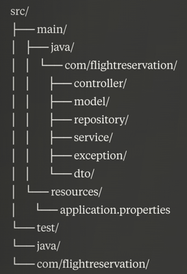
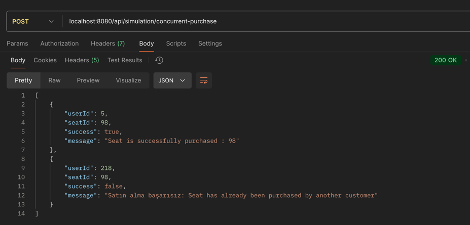
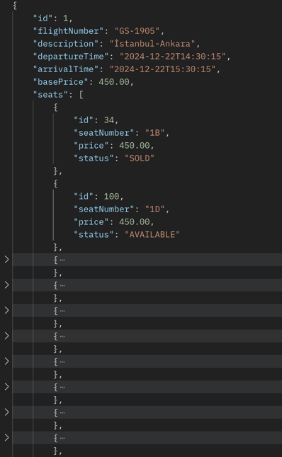

# Flight Reservation System

Bu proje, bir uçak bileti rezervasyon sisteminin backend uygulamasıdır. Spring Boot ve Java 11 kullanılarak geliştirilmiştir.

## Özellikler

### Uçuş İşlemleri
- Uçuş ekleme
- Uçuş güncelleme
- Uçuş silme
- Uçuş listeleme

### Koltuk İşlemleri
- Koltuk ekleme
- Koltuk silme
- Koltuk satın alma
- Mevcut koltukları listeleme

### Eş Zamanlı İşlem Yönetimi
- Optimistic locking ile aynı koltuğun eş zamanlı satın alınması engellenir
- İlk ödeme işlemini başarıyla gerçekleştiren yolcu koltuğu satın alır
- İkinci yolcu, uygun bir hata mesajıyla bilgilendirilir

## Teknik Detaylar

### Kullanılan Teknolojiler
- Java 11
- Spring Boot 2.5.5
- Spring Data JPA
- H2 Database
- Maven

### Proje Yapısı

### DB'e erişim
- Config verileri application.properties içerisindedir 
- http://localhost:8080/h2-console 
### API Endpoints

#### Uçuş İşlemleri
- `GET /api/flights/get-flight/{id}` - Belirli bir uçuşu getirme
- `GET /api/flights/get-all-flights` - Tüm uçuşları listeleme
- `POST /api/flights/create-flight` - Yeni uçuş ekleme
- `PUT /api/flights/update-flight/{id}` - Uçuş güncelleme
- `DELETE /api/flights/delete-flight/{id}` - Uçuş silme

#### Koltuk İşlemleri
- `POST /api/seats/{flightId}/create-seat` - Belirli bir uçuş için yeni koltuk ekleme
- `GET /api/seats/get-seat/{id}` - Belirli bir koltuğu getirme
- `POST /api/seats/purchase-seat/{id}` - Koltuk satın alma
- `DELETE /api/seats/delete-seat/{id}` - Koltuk silme

#### Simülasyon İşlemi
- `POST /api/simulation/concurrent-purchase` - İki farklı kullanıcının aynı koltuğu eş zamanlı satın alma simülasyonu
    - Test senaryosu:
        - Thread-1: SeatId: 97, userId: 5
        - Thread-2: SeatId: 97, userId: 218

### Örnek Request/Response

##### 1. Aynı koltuğu aynı anda satın almak isteyen iki yolcu
- POST /api/simulation/concurrent-purchase

##### 2. Belirli Bir Uçuşu Getirme
- GET /api/flights/get-flight/{id}

